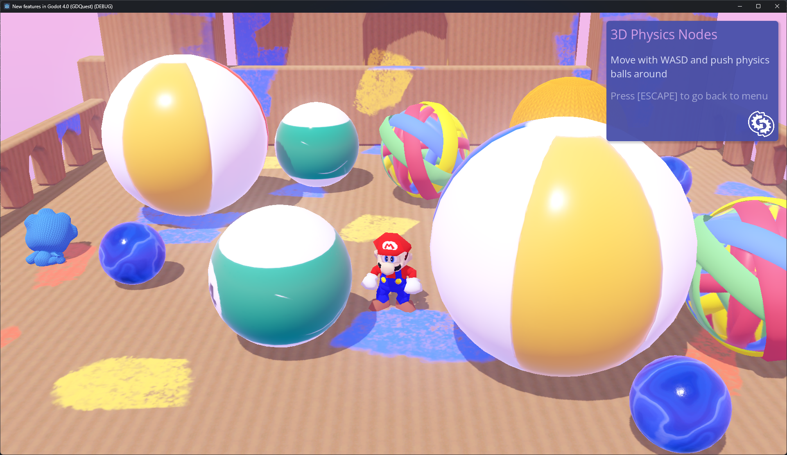

# libsm64-godot

Addon that binds [libsm64](https://github.com/libsm64/libsm64) to godot via GDExtention, allowing to integrate mario into any Godot 4 project.

## Projects using libsm64-godot

| [Infinite Mario 64 (by TwilightPB)](https://twilightpb.itch.io/infinite-mario-64) |  |
|-------------------------------------------------------------------|------------------------------------------------------------------------------------------------------------------------------------------------------|

## Current Godot compatibility

Currently compatible with Godot 4.2.x, with binaries compiled for Windows and Linux (untested) 64 bits. Check the [Releases](https://github.com/Brawmario/libsm64-godot/releases) for the files.

## How to compile the GDExtension

If you just clone the project throught Git and attempt to run it, you'll get errors complaining about the lack of the GDExtension library (the project zip file in the Releases page already has the necessary binaries packaged).

First, [build libsm64](https://github.com/libsm64/libsm64?tab=readme-ov-file#building-on-windows) and then copy (don't move) the genereated dynamic library from the `extension/libsm64/dist/` folder into `addons/libsm64-godot/extension/bin`.

Setup the [requirements for building Godot with MinGW](https://docs.godotengine.org/en/stable/contributing/development/compiling/compiling_for_windows.html#requirements). Then, run the following command from inside of the `extension` folder to compile the GDExtension. It will automatically copy the generated binary into `addons/libsm64-godot/extension/bin`.

- For debug build: `scons target=template_debug use_mingw=yes`
- For release build: `scons target=template_release use_mingw=yes`

Note: if you are using `MSYS2` to compile, you must run this command from the `MSYS2 MINGW64` terminal window.

## How to use

This add-on consists of two main components:

- `SM64Global`: Singleton that exposes the `init()` and `terminate()` functions of the libsm64 library.
- `SM64Mario`: Extends Node3D; can have multiple in any scene.

It also adds two helper nodes:

- `SM64StaticSurfaceHandler`: Extends Node; provides helper functions to load all the meshes under the `libsm64_static_surfaces` group into the `libsm64` world.
- `SM64SurfaceObjectsHandler`: Extends Node; provides helper functions to load and update all the meshes under the `libsm64_surface_objects` group into the `libsm64` world.

This add-on requires a Super Mario 64 (USA) ROM file (for legal reasons, steps to get a ROM will not be disclosed). Make sure the ROM file has the following SHA256 hash:

>17ce077343c6133f8c9f2d6d6d9a4ab62c8cd2aa57c40aea1f490b4c8bb21d91

If the SHA256 doesn't match, it will be rejected and the addon will fail to initialize.

## Simple steps for basic use

When creating the scene:

1. Add a `SM64StaticSurfaceHandler` node to the scene.
2. Add the meshes that compose the world to the `libsm64_static_surfaces` group (NOTICE: use simple, low-polycount meshes for best results).
3. Add a `SM64Mario` node (or as many as you want) and set its camera property with an `Camera3D` node.
4. Create the action names that are in the `SM64Mario` node's `Input Actions` export group in the project's Input Map and bind them to the appropriate axes/buttons/keys.

Then do the following on the scene's main script:

1. Feed the `SM64Global` singleton the file path to the Super Mario 64 ROM file (`SM64Global.rom_filepath = "path/to/rom/file"`).
2. Configure the `SM64.Global.scale_factor` property if necessary (try default value first).
3. Call the `SM64Global.global_init()` function.
4. Call `StaticSurfaceHandler.load_static_surfaces()` on your instanced `SM64StaticSurfaceHandler` node.
5. Call `SM64Mario.create()` on your instanced `SM64Mario` node(s).

For more detailed instructions refer to the [manual](docs/manual.md).
