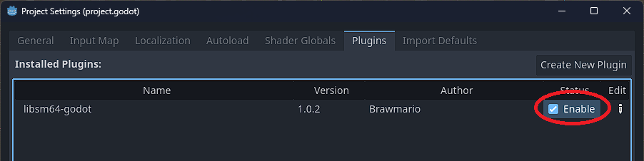
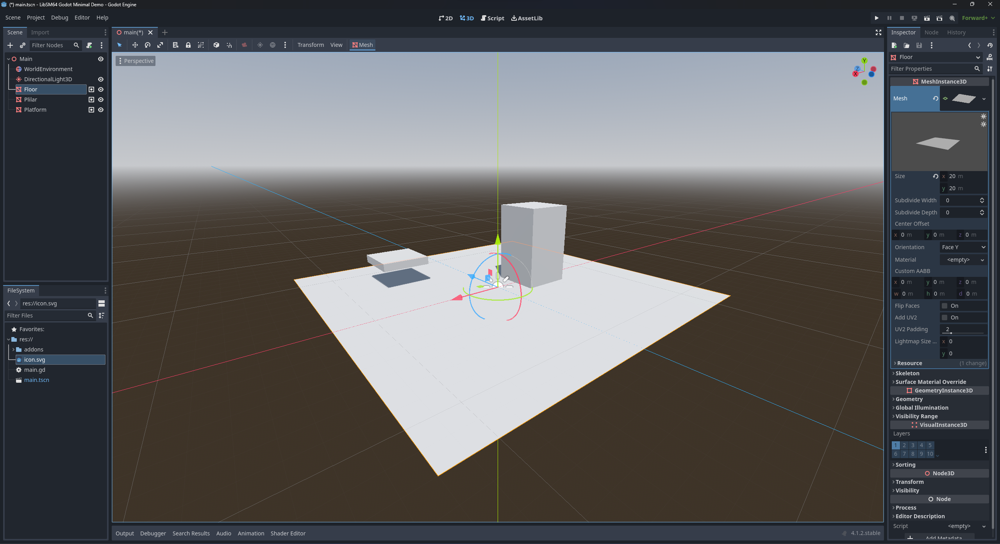
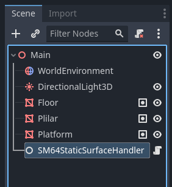
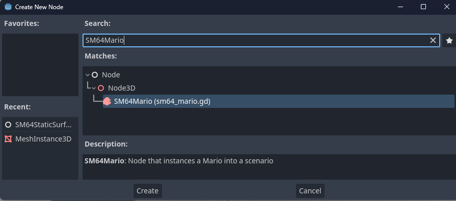
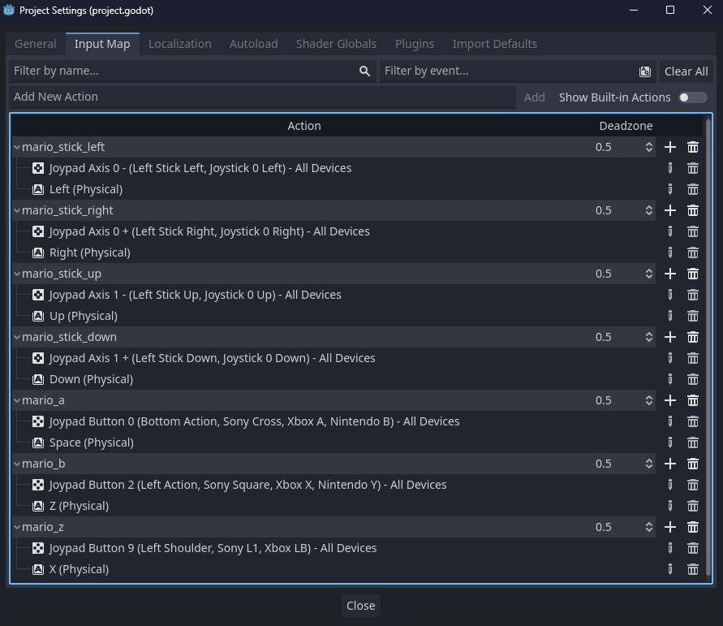
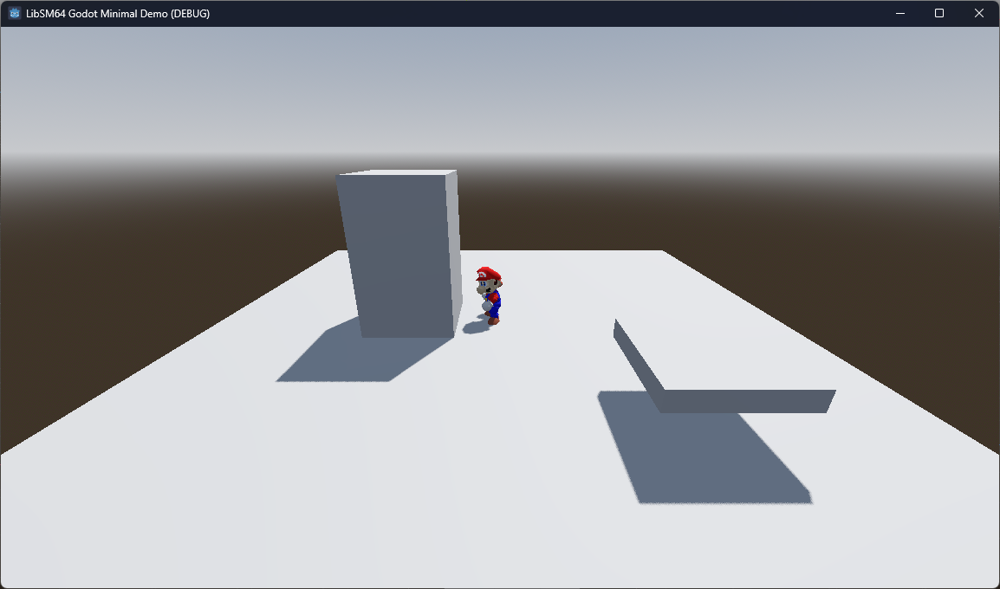

# Libsm64 Godot addon manual

NOTE: the node names in the screenshots in this manual are outdated, they should be prefixed with `LibSM64` instead of `SM64`.

## Installation

You can get the addon from the [Godot Asset Library](https://godotengine.org/asset-library/asset/3653) or from the [GitHub releases page](https://github.com/Brawmario/libsm64-godot/releases). You should have the `addons/libsm64_godot` folder in your project folder.

If done correctly, the addon should show up under `Project Settings > Plugins`. Enable the addon on this same screen.



Note: You might get a `Error loading extension: res://addons/libsm64_godot/extension/libsm64.gd.gdextension` message. Try reloading the project or re-adding the addon, this error seems inconsistent.

## How to setup basic use

### Providing the ROM

In order to use libsm64-godot, a ROM of Super Mario 64 (USA) is necessary (for legal reasons, steps to get a ROM will not be disclosed). Make sure the ROM file has the following SHA256 hash:

>17ce077343c6133f8c9f2d6d6d9a4ab62c8cd2aa57c40aea1f490b4c8bb21d91

The path to this ROM file needs to be provided to the `LibSM64Global` static class when calling `LibSM64Global.load_rom_filepath(filepath: String)` before you can call the `LibSM64Global.init()` method. If the SHA256 doesn't match, it will be rejected and the addon will fail to initialize.

The ROM file does not need to be included with a project that uses this addon and can be dynamically sourced from the user at runtime in order to avoid the unauthorized distribution of copyrighted material. Check the `main` scene in the included demo project on this repository for an example on how to request a filepath from the user at runtime.

### Setting up a scene

For this example I will setup a basic 3D scene with meshses that will serve as static collision surfaces. If you are trying to put Mario in a already existing scene you can reuse the already existing meshes, but it is best to use the simplest meshses possible for collision (you can make the meshes invisible if you're only creating them to establish collision).

The scene for this example is this:



The floor a is 20 meters by 20 meters plane and the pillar is a 5 meters tall rectangular prism.

### Static Surfaces

In order to allow the addon to use the meshes as collision, you'll need to add an `LibSM64StaticSurfaceHandler` node to the scene via the Create New Node dialog. Then, you'll need to add all the meshes that will serve as the Static Surfaces of the world to the node group specified by the `static_surfaces_group` field of the `LibSM64StaticSurfaceHandler` node (by default the group name will be `libsm64_static_surfaces`, you shouldn't really need to change this).




### SM64Mario node

Create a `LibSM64Mario` node and add it to the scene. You'll also want to add a `Camera3D` node to the scene at this point. The camera will be static for this demo.



Position the camera appropriately and position the `LibSM64Mario` node a little bit above the plane. Inspect the `LibSM64Mario` node, click on the `Camera` property and pick the `Camera3D` in the scene tree.


Take note of the properties under the `Mario Inputs Actions` export group. These are the action names used by the node in order to control Mario. Either change these action names to other names already in the project's Input Map (such as the `ui_*` action names) or create these action names in the project's Input Map and bind them to the appropriate axes/buttons/keys.



### Final scene setup - basic script

Add a new script on the root node. The following script snippet is a simple example on how to initialize the `libsm64` world and how to initialize the `LibSM64Mario` node.

```Swift
extends Node3D


@onready var libsm_64_mario: LibSM64Mario = $LibSM64Mario
@onready var libsm_64_static_surface_handler: Node = $LibSM64StaticSurfaceHandler


func _ready() -> void:
	# Load the ROM file to `LibSM64Global`.
	# Avoid hardcoding this parameter, you should get this path on runtime.
	# If the SHA-256 hash of the ROM file does not match the expected hash, loading will fail.
	var rom_filepath := "/path/to/rom/file.z64"
	if not LibSM64Global.load_rom_file(rom_filepath):
		push_error("Failed to load SM64 ROM file.")
		return

	# Init the `libsm64` world.
	LibSM64Global.init()

	# Init the static surfaces (make sure the relevant MeshIntance3D nodes are ready and in the appropriate group).
	libsm_64_static_surface_handler.load_static_surfaces()

	# Initialize the SM64Mario node.
	# both the `libsm64` world and the Static Surfaces must be already initialized without errors.
	libsm_64_mario.create()


func _on_tree_exiting() -> void:
	# Clean up the `libsm64` world when the scene is freed.
	libsm_64_mario.delete()
	SM64Global.terminate()
```

If everything goes correctly, you should be able to run this scene and get it all to work.



## Futher setup

### Surface Objects

TODO

### Surface properties

TODO

## Quirks

### Have a big plane below your world added to the Static Surfaces

TODO

### Low poly mesh (make collion specific meshes)

TODO
